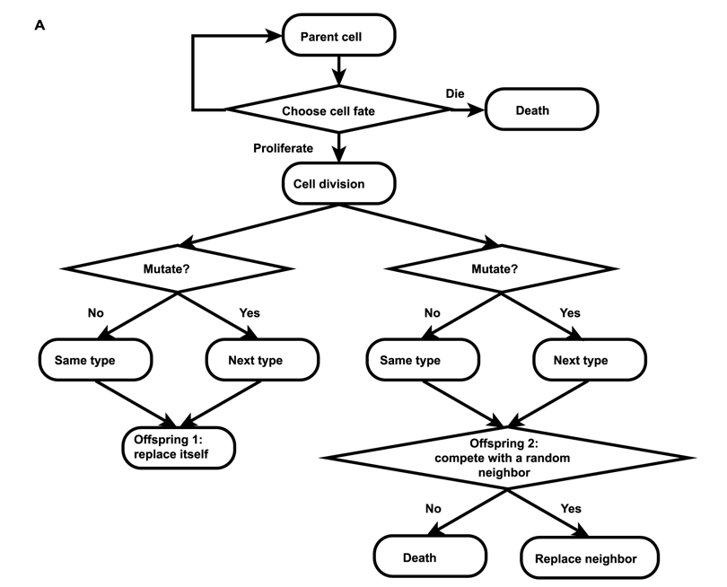

# TumorSimulation_BDsingleCell


This is an agent-based model of tumor growth. It can simulate tumor expansion on a 2D grid. Features include:

- Simulate individual cell behavior including proliferation, mutation, competing and migration.
- Simulate individual cell genotype
- Allow different cell classes, cells in different classes have a different set of parameters
- Track cell lineage information

<p align="center">
  
</p>


Compire with:
```
g++ -std=c++0x *.cpp -o output
```

Example parameter setting file under examples.
